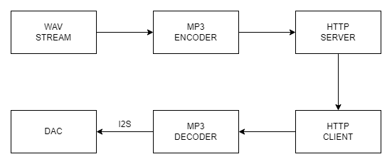

＂It is not because men’s desires are strong that they act ill; it is because their consciences are weak. ＂

## 为什么是ESP-32
　　这几年ARM的芯片狂涨，无论是哈佛架构的MCU还是冯诺依曼的嵌入式芯片都涨了几倍到几十倍不等。原来打算采用的STM32F407VET6从2020年的二十几直接涨到了接近一百。这种的成本对我这种没有上海人那样随手三把刀的雄厚财力的凡人肯定是无法接受的。非常幸运作为傻逼ARM芯片的同为替代，使用ESP-32系列芯片是非常不错的解决方案。ESP-32的30个IO口完全可以胜任控制elink，mp3解码板和tf模块的任务，同时ESP内嵌的WiFi和蓝牙功能对之后的功能扩展大概率不会有十分友善。

## 音频播放部分
　　ESP-32自带播放.WAV无损格式音乐的功能，但短短3分钟的.wav文件就要占据将近五十mb的夸张容量，在再三权衡之下我决定使用 ~~PCM5102的数模解码板（I2S音频总线）某宝21\~70元不等来作为播放器的解码设备。~~ 呃迫于财力本人买不起这么贵的DAC，只能用也许是上世纪的产品CS4344作为替代。代价就是垃圾的音质，以及这个芯片并没有PLL锁相环，只能再加一根mclk。呃只能说我看了芯片手册基本上一大半都是看不懂的，后续的功能详解有缘更新。

　　~~存储部分ESP-32自带的4Mb FLASH显然不够，SPI接口的microsd的模块某宝也遍地都是，三块钱轻松拿下。Arduino自带sd控制的库，直接调库就完事了。~~ 我并不是很明白为啥要用FLASH，买esp看中的不就是其网络能力吗。（除非播放flac）

　　先是拿杜邦线把开发板和功能模块接起来，后续试验完全部功能后会~~整体画一块板子来提高集成度也许。~~ 我是不会。软件实现用到了ESP32-audioI2S 这个github上的库，它提供了非常完善的基于I2S总线的音频播放的功能，让我的音频播放部分能在短短~~一星期~~两天就实现。

## 施工中
单用来播放音频好像有点太简单了，除了播放网络音频外，我不禁想多加一点功能，比如把普通音响改造成WiFi音响之类的。

注意上图中所有数据都是stream，理论上ESP32看成一个无线播放设备。但是由于采集延迟+编码延迟+网络延迟+ESP32-audioI2S的缓冲延迟，延迟比较感人

进度：
- 能放歌了（人声：美しきもの √;纯音乐：you √;音质：我为啥感觉和我的~~Walkman~~原道差不多）
- windows上能串流了，但是有5-10s不等的延迟
- 懒得优化了，我又不是电信专业第一

## 版权
此README完全抄袭ryujopad

https://blog.higuchi.xyz/2021/09/27/2021-9-27
